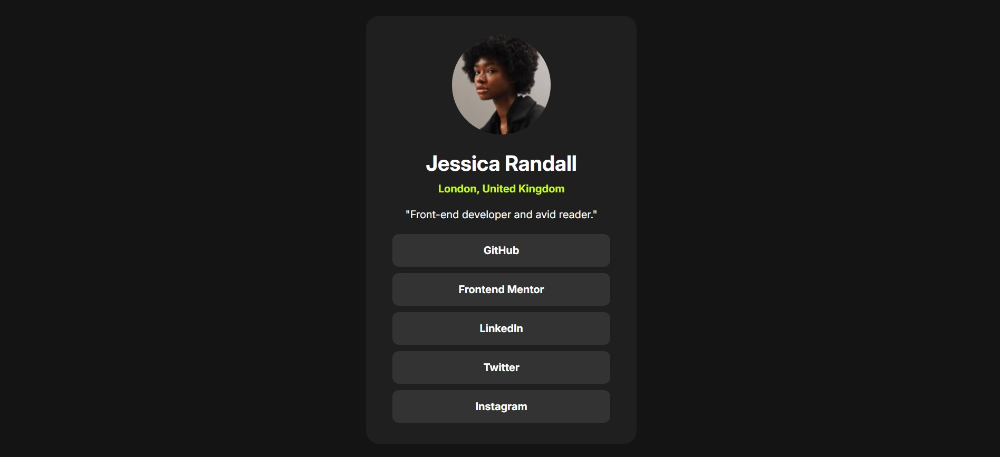

# 🌐 Projeto Links Sociais

Aplicação simples e responsiva para reunir todos os seus links em um só lugar, como um **cartão de visitas digital**.  
Inspirado em ferramentas como Linktree, mas desenvolvido do zero com **HTML e CSS**.

---

## 🖼️ Demonstração

👉 [Acesse o projeto online](https://brrn91.github.io/projeto-links-sociais/)

---

## 🛠️ Tecnologias Utilizadas
- **HTML5**
- **CSS3**
- Responsividade para diferentes dispositivos

---

## ⚙️ Funcionalidades
- ✅ Exibe avatar e nome do usuário  
- ✅ Lista de links personalizáveis  
- ✅ Design limpo e responsivo  
- 🚀 Fácil de publicar no GitHub Pages  

---

💡 **Nota:** Este projeto faz parte do meu aprendizado e portfólio. Feedbacks são bem-vindos! 😊
